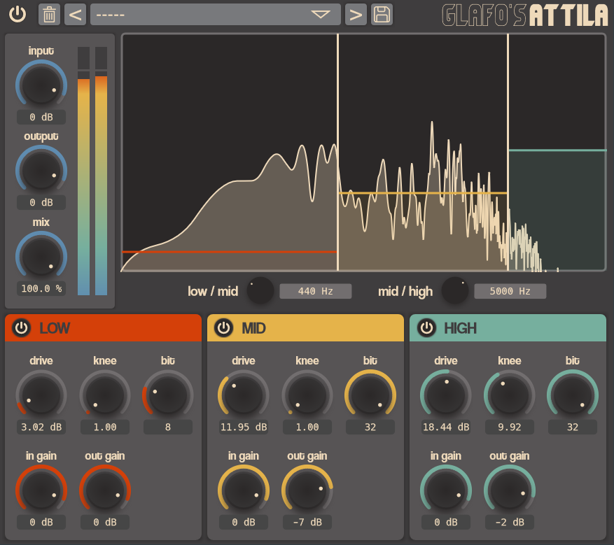

# Attila

Attila is an open-source multiband distortion and bitcrushing plug-in. Within each band, you can completely tweak various parameters such as drive amount, drive knee and bit resolution, allowing you to create a wide range of effects—from the most wholesome 🤗♥ soft saturation ✨🥰 to full-on ear-piearcing sound demolition.

It is made with JUCE and it's available for Windows, MacOS and Linux in VST, AU and LV2 formats.

--

## To-do

* Improve performance

--

## License

`attila` is [GPLv3 licensed](https://github.com/glafiro/attila/blob/main/LICENSE).